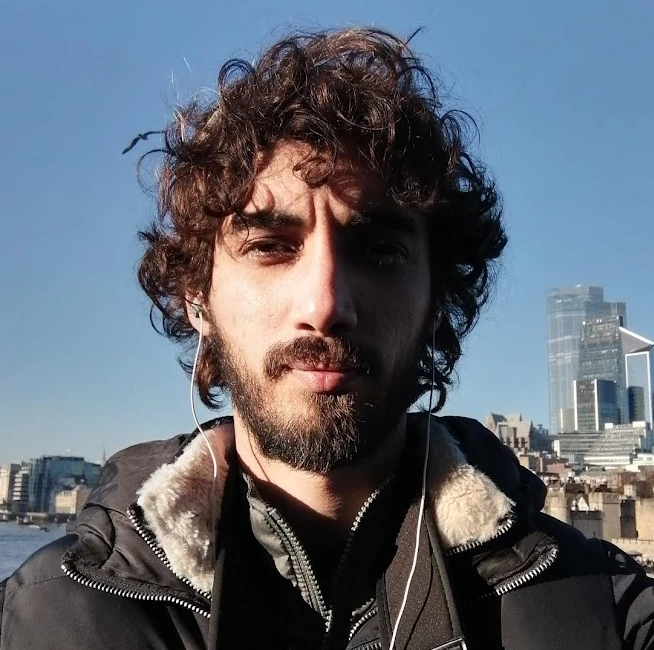

I am a Ph.D. in Computer Science (UNICAMP - Brazil) and Machine Learning/Deep Learn Compiler Engineer at Cadence Design Systems (San Jose - US).

I have experience working with Python, C, C++, ONNX, MLIR, and Linux Shell, having contributed to FLOSS projects such as LLVM, Tensorflow/XLA, and QEMU.

I am a Brazilian, I love to travel, skate, dance, and learn. In this blog, I will try to share some of the stuff that I am learning through life.
